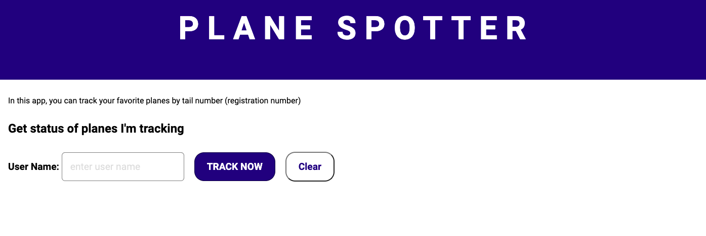

# 
 Plane Spotter 

_This is being created during my time as a student at Code Chrysalis, and is currently under initial development_

**Plane Spotter** is an app for those who enjoy plane spotting at a hobby. The idea behind this app to track particular aircraft that you would like to get notifications on when it will be inboud at an airport near you.

## Application APIs

This application utilizes data from **Airlabs** for all aircraft and flight information.

The follow APIs specific to this application:

### Users API

- `POST` **/api/users** - creates a new user
- `GET` **/api/users** - returns a list of all users
- `GET` **/api/users/USERNAME** - returns user information for a specified user when a user name is passed
- `PATCH` **/api/users/USERNAME** - updates a users information
- `DELETE` **/api/users/USERNAME** - removes a user from the database

### Follow API

- `POST` **/api/follows** - adds new following entry for username and aircraft
- `GET` **/api/follows** - returns a list of all users the planes they are following
- `GET` **/api/follows/USERNAME** - returns the list of aircraft for a user with flight data
- `PATCH` **/api/follows/USERNAME** - updates a follow entry when the given `username` and `plane_reg` match
- `DELETE` **/api/follows/USERNAME** - removes a `username` & `plane_reg` pair entry

## APPLICATION UI

In the inital implementation of the UI, the static HTML page allows the users to get an updated list of the planes they are following by entering their username.

The following are currently under development:

- Database
- Advanced APIs
- REACT UI
- Deployment
